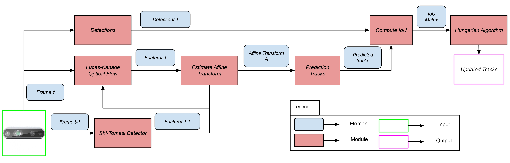

# <strong> AgriSORT: A Simple Online Real-time Tracking-by-Detection framework for robotics in precision agriculture </strong> 

### [Paper](https://arxiv.org/abs/2309.13393) | [Dataset](https://drive.google.com/drive/folders/1sbsUwCtGQtA58cLVP5sd37tjjkMFCh05?usp=drive_link) | [Weights](https://drive.google.com/drive/folders/1Kl3srt2J0u48Gyx6M1YvrqMnCTNrQz-W?usp=drive_link) | [Video](video_link)

<p>


</p>

Repository for the paper **AgriSORT: A Simple Online Real-time Tracking-by-Detection framework for robotics in precision agriculture**, accepted at ICRA 2024. We propose a novel Multiple Object Tracking (MOT) algorithm specific for usage in precision agriculture. We also present a novel dataset on multiple objects tracking in the context of precision agriculture based on table grapes captured using a **RealSense d435i** camera.

<p float="left">
    
</p>

> **AgriSORT: A Simple Online Real-time Tracking-by-Detection framework for robotics in precision agriculture**\
> Leonardo Saraceni, Ionut M. Motoi, Daniele Nardi, Thomas A. Ciarfuglia https://arxiv.org/abs/2309.13393 (Temporary, accepted to ICRA 2024, soon to appear)

## <strong> Setup: </strong>
To test the tool is necessary to clone the repository and install the required dependencies.

* ### <strong> Python dependencies: </strong>
    ```
    pip3 install -r requirements.txt
    ```
* ### <strong> Clone YOLOv5 repository: </strong>
    ```
    git clone https://github.com/ultralytics/yolov5  # clone
    cd yolov5
    pip install -r requirements.txt  # install
    ```
* ### <strong> Download detection weights: </strong>
    Download weights from the Link: 
    ## [Weights](https://drive.google.com/drive/folders/1Kl3srt2J0u48Gyx6M1YvrqMnCTNrQz-W?usp=drive_link)

    **Alternatively** you can download them via command line:
    ```
    gdown --folder --remaining-ok https://drive.google.com/drive/folders/1Kl3srt2J0u48Gyx6M1YvrqMnCTNrQz-W?usp=drive_link
    ```

## <strong> Use tracker: </strong>
We provide a small demo to :
* ### <strong> Download dataset (Optional): </strong>
    Download the dataset from the Link:
    ## [Dataset](https://drive.google.com/drive/folders/1sbsUwCtGQtA58cLVP5sd37tjjkMFCh05?usp=drive_link)

    **Alternatively** you can download them via command line:
    ```
    gdown --folder --remaining-ok https://drive.google.com/drive/folders/1Kl3srt2J0u48Gyx6M1YvrqMnCTNrQz-W?usp=drive_link
    ```
* ### <strong> Run tracker: </strong>
    By default the tracker runs on the **CloseUp1** sequence.
    ```
    python3 agriSORT.py
    ```

    To visualize all the possible settings, visualize help:
    ```
    python3 agriSORT.py --help
    ```

## Citation
```
@misc{saraceni2023agrisort,
      title={AgriSORT: A Simple Online Real-time Tracking-by-Detection framework for robotics in precision agriculture}, 
      author={Leonardo Saraceni and Ionut M. Motoi and Daniele Nardi and Thomas A. Ciarfuglia},
      year={2023},
      eprint={2309.13393},
      archivePrefix={arXiv},
      primaryClass={cs.CV}
}
```